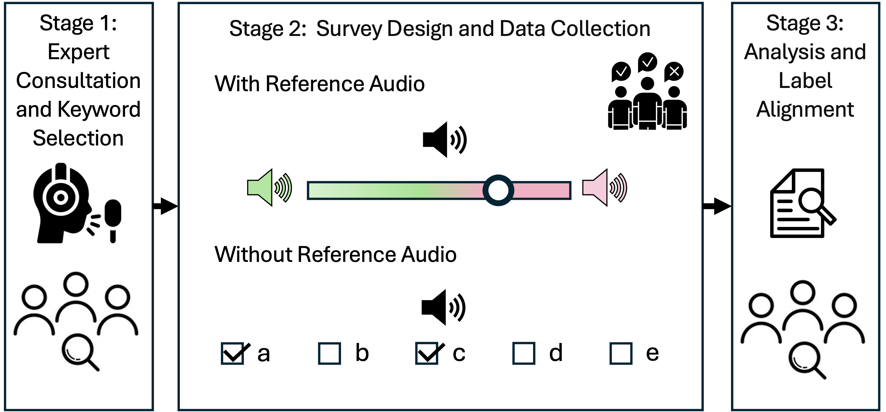
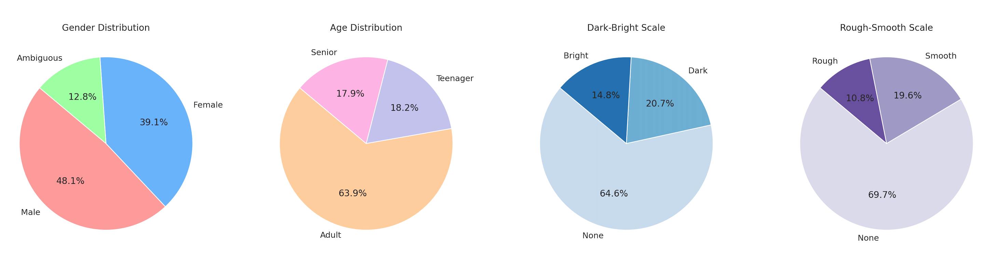
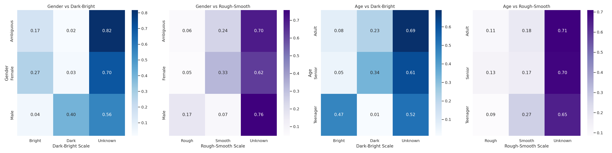
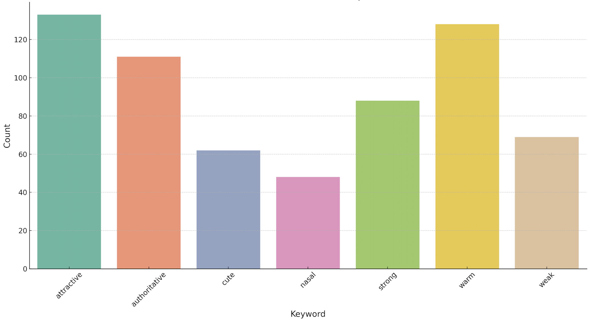

# 📝 DreamVoiceDB: Voice Timbre Dataset

The DreamVoiceDB dataset is an integral part of our research on voice timbre and its diverse characteristics. This page provides a detailed overview of the dataset creation process, the criteria for speaker selection, the methodology for keyword annotation, and our approach to enhancing the dataset's richness and authenticity.

## Overview

Voice timbre is shaped by a myriad of factors, including age, gender, physical properties of the vocal tract and vocal cords, and perceptual characteristics. To effectively encapsulate the multifaceted nature of voice timbre, we employed a comprehensive three-stage process.

#### Figure: Survey Method

*Figure 1: Schematic diagram of DreamVoiceDB survey method.*

## Details

- **Datasets Used**: LibriTTS-R and VCTK
- **Number of Speakers**: 900 [100 from VCTK and 800 from LibriTTS-R, sampled randomly]
- **Keyword Selection Process**:
  - Guided by an expert voice actor
  - Total of 10 keywords identified
  - Keywords categorized based on relative objectivity and subjectivity
- **Annotator Profile**:
  - Total Annotators: 8 (4 females and 4 males)
  - Expertise: Speech pathology, accent coaching, singing coaching, transcription, and translation

You can find our sample survey page used for data collection here - [DreamVoiceDB Survey Link](https://sm7orzxyhu.cognition.run/)

## Keywords and Descriptors

The DreamVoiceDB dataset utilizes a variety of keywords and descriptors to annotate voice timbre. These are grouped into relatively objective and subjective categories, along with additional aspects related to suitability for various voice-related professions.

### Relatively Objective Keywords [Multtple Options Single Choice]
- **Age**: 'Teenager or Young', 'Adult or Neutral', and 'Senior or Old'.
- **Gender**: 'Definitely Female', 'Somewhat Ambiguous / Neutral'.
- **Brightness**: Ranging from 'Very Dark (Rich)' to 'Very Bright (Thin)'.
- **Roughness**: From 'Rough (Raspy)' to 'Smooth (Mellow)'.

Reference Audio can be found in the following powerpoint presentation: [DreamVoiceDB Reference Audio](./data/reference_audio.pptx)

### Relatively Subjective Keywords [Multiple Options Multiple Choice]
- **Nasal**: A noticeable resonance or vibration in the nasal passages.
- **Breathy**: You can hear the flow of air as the person speaks.
- **Weak**: Lack of energy and confidence.
- **Strong**: Full, resonant, and confident.
- **Cute**: Perceived as young and endearing.
- **Attractive**: A voice that draws pleasure in listeners.
- **Cool**: Laid-back, confident, and collected.
- **Warm**: A voice that conveys kindness, sincerity, and comfort.
- **Authoritative**: A voice that carries weight and command.
- **Others**: Other characteristics but not related to the speaker's emotion.

### Additional Aspects
This includes evaluating the voice's fit for professions such as singing, acting, public speaking, and other vocations where vocal qualities are paramount. Specific examples include:
- **Public Presentation**: Public Speaker, Motivational Speaker, Teacher, Tour Guide
- **Storytelling**: Podcaster, Audiobook Narrator
- **Client and Public Interaction**: Customer Service, Healthcare Communicator, Retail Associate, Receptionist
- **Diplomacy and Judiciary**: Diplomat, Judge
- None of the above

Each keyword and descriptor plays a crucial role in accurately capturing and conveying the unique characteristics of each voice sample in the dataset.

### Analysis and Enhancement

- Agreement scores used to prioritize keywords
- Rigorous reassessment for moderately agreed keywords
- For each speaker we atleast have age and gender keywords
- Other keywords are selected based on the Agreement scores
- We do not use any fine grained annotations for darkness and roughness in the model training
- Use of OpenAI's GPT4 for natural language descriptors
- Generation of descriptors based on all keyword combinations

Generated Descriptors Examples:

| Speaker ID | WAV File        | Keywords              | Prompt                                              |
|------------|-----------------|-----------------------|-----------------------------------------------------|
| 2562       | [File 2562](#)  | Male, Adult, Dark     | An adult male voice, with a dark timbre.            |
| 30         | [File 30](#)    | Female, Teenager, Bright | A teenage girl's voice, radiating brightness and energy. |
| 2156       | [File 2156](#)  | Male, Senior, Strong  | A senior male voice, characterized by strength and power. |

## Dataset Statistics

## Access to Dataset and Analysis
- DreamVoiceDB 
    - Pre-processed Version:[Download:]()
    - Raw Version: [Download:]()

- Code for Dataset:[Repo:]()

