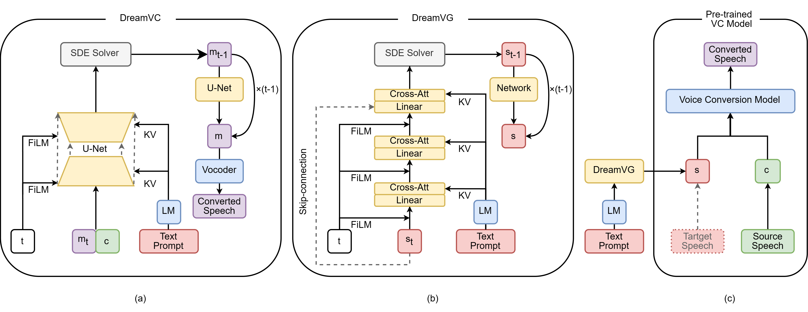

# Proposed Models

*Overview of the (a) DreamVC, (b) DreamVG, and (c) Plugin Strategy. Modules in blue are pre-trained models and remain frozen during training, while modules in yellow are trained. Green blocks represent the source speaker information while red blocks represent the target speaker information. Purple blocks correspond to the converted speech. Dashed lines represent skip connections. LM represents the Language Model. $KV$ represents Cross-Attention \cite{vaswani2017attention} and FiLM represents Feature-wise Linear Modulation layers \cite{perez2018film} used for fusing Text Prompt and diffusion step $t$ respectively. SDE solver is the stochastic differential equations for the diffusion sampling. Text Prompt is the text description about the desired target voice. $t$ is the diffusion step. $c$ is the content embedding of the source speaker. $s$ is the speaker embedding of the target voice. $m$ is the mel-spectrogram. $m_t$ and $s_t$ represent the noisy versions of the mel-spectrogram and the speaker embedding at the diffusion step $t$.*

# Audio Samples

