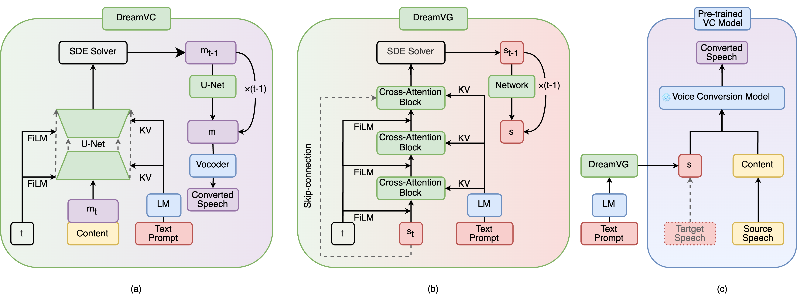

 

<h1>DreamVoice: Text-guided Voice Conversion</h1> 

Jiarui Hai1*, Karan Thakkar1*, Helin Wang1, Zengyi Qin2,3, Mounya Elhilali1  1Johns Hopkins University, Baltimore, USA  2Massachusetts Institute of Technology, Cambridge, MA, USA  3MyShell.ai, USA  *equal contribution

🚀Code is available: <a href="https://github.com/myshell-ai/DreamVoice">DreamVoice</a>
 

 

## Introduction

DreamVoice is an innovative approach to voice conversion (VC) that leverages text-guided generation to create personalized and versatile voice experiences. Unlike traditional VC methods, which require a target recording during inference, DreamVoice introduces a more intuitive solution by allowing users to specify desired voice timbres through text prompts.

## Demo
<table align="center" style="margin: 0px auto; width: 100%;">
  <tr>
    <th style="text-align: center; vertical-align: middle; width: 15%;">Source</th>
    <th style="text-align: center; vertical-align: middle; width: 45%;">Prompt</th>
    <th style="text-align: center; vertical-align: middle; width: 13%;">DreamVC</th>
    <th style="text-align: center; vertical-align: middle; width: 13%;">DreamVG+ReDiffVC</th>
    <th style="text-align: center; vertical-align: middle; width: 13%;">DreamVG+FreeVC</th>
  </tr>
  <tr>
    <td style="text-align: center; vertical-align: middle;">
      <audio controls style="width: 100px; height: 30px;">
        <source src="gt/652_129742_000010_000003.wav" type="audio/wav">
      </audio>
    </td>
    <td style="text-align: left; vertical-align: middle;">
      A smooth young voice with a gender-neutral tone, that sounds cute.
    </td>
    <td style="text-align: center; vertical-align: middle;">
      <audio controls style="width: 100px; height: 30px;">
        <source src="dreamvc/3_A smooth young voice with a gender-neutral tone, that sounds cute. .wav" type="audio/wav">
      </audio>
    </td>
    <td style="text-align: center; vertical-align: middle;">
      <audio controls style="width: 100px; height: 30px;">
        <source src="dreamvg/3_A smooth young voice with a gender-neutral tone, that sounds cute. .wav" type="audio/wav">
      </audio>
    </td>
    <td style="text-align: center; vertical-align: middle;">
      <audio controls style="width: 100px; height: 30px;">
        <source src="dreamvg/3_A smooth young voice with a gender-neutral tone, that sounds cute. _freevc.wav" type="audio/wav">
      </audio>
    </td>
  </tr>
  <tr>
    <td style="text-align: center; vertical-align: middle;">
      <audio controls style="width: 100px; height: 30px;">
        <source src="gt/174_50561_000023_000000.wav" type="audio/wav">
      </audio>
    </td>
    <td style="text-align: left; vertical-align: middle;">
      Authoritative sounding person, who is gender-ambiguous and adult.
    </td>
    <td style="text-align: center; vertical-align: middle;">
      <audio controls style="width: 100px; height: 30px;">
        <source src="dreamvc/4_Authoritative sounding person, who is gender-ambiguous and adult..wav" type="audio/wav">
      </audio>
    </td>
    <td style="text-align: center; vertical-align: middle;">
      <audio controls style="width: 100px; height: 30px;">
        <source src="dreamvg/4_Authoritative sounding person, who is gender-ambiguous and adult..wav" type="audio/wav">
      </audio>
    </td>
    <td style="text-align: center; vertical-align: middle;">
      <audio controls style="width: 100px; height: 30px;">
        <source src="dreamvg/4_Authoritative sounding person, who is gender-ambiguous and adult._freevc.wav" type="audio/wav">
      </audio>
    </td>
  </tr>
  <tr>
    <td style="text-align: center; vertical-align: middle;">
      <audio controls style="width: 100px; height: 30px;">
        <source src="gt/2428_83699_000009_000003.wav" type="audio/wav">
      </audio>
    </td>
    <td style="text-align: left; vertical-align: middle;">
      Senior's voice who can sound like a male or female with a smooth voice, perfect for storytelling.
    </td>
    <td style="text-align: center; vertical-align: middle;">
      <audio controls style="width: 100px; height: 30px;">
        <source src="dreamvc/5_Senior's voice who can sound like a male or female with a smooth voice, perfect for storytelling..wav" type="audio/wav">
      </audio>
    </td>
    <td style="text-align: center; vertical-align: middle;">
      <audio controls style="width: 100px; height: 30px;">
        <source src="dreamvg/5_Senior's voice who can sound like a male or female with a smooth voice, perfect for storytelling..wav" type="audio/wav">
      </audio>
    </td>
    <td style="text-align: center; vertical-align: middle;">
      <audio controls style="width: 100px; height: 30px;">
        <source src="dreamvg/5_Senior's voice who can sound like a male or female with a smooth voice, perfect for storytelling._freevc.wav" type="audio/wav">
      </audio>
    </td>
  </tr>
  <tr>
    <td style="text-align: center; vertical-align: middle;">
      <audio controls style="width: 100px; height: 30px;">
        <source src="gt/777_126732_000076_000013.wav" type="audio/wav">
      </audio>
    </td>
    <td style="text-align: left; vertical-align: middle;">
      A female adult voice with a warm and bright voice, perfect for client and public interaction.
    </td>
    <td style="text-align: center; vertical-align: middle;">
      <audio controls style="width: 100px; height: 30px;">
        <source src="dreamvc/6_A female adult voice with a warm and bright voice, perfect for client and public interaction..wav" type="audio/wav">
      </audio>
    </td>
    <td style="text-align: center; vertical-align: middle;">
      <audio controls style="width: 100px; height: 30px;">
        <source src="dreamvg/6_A female adult voice with a warm and bright voice, perfect for client and public interaction..wav" type="audio/wav">
      </audio>
    </td>
    <td style="text-align: center; vertical-align: middle;">
      <audio controls style="width: 100px; height: 30px;">
        <source src="dreamvg/6_A female adult voice with a warm and bright voice, perfect for client and public interaction._freevc.wav" type="audio/wav">
      </audio>
    </td>
  </tr>
  <tr>
    <td style="text-align: center; vertical-align: middle;">
      <audio controls style="width: 100px; height: 30px;">
        <source src="gt/2078_142845_000085_000003.wav" type="audio/wav">
      </audio>
    </td>
    <td style="text-align: left; vertical-align: middle;">
      A dark, smooth, and authoritative adult female voice, who sounds attractive and ideal for storytelling.
    </td>
    <td style="text-align: center; vertical-align: middle;">
      <audio controls style="width: 100px; height: 30px;">
        <source src="dreamvc/7_A dark, smooth, and authoritative adult female voice, who sounds attractive and ideal for storytelling..wav" type="audio/wav">
      </audio>
    </td>
    <td style="text-align: center; vertical-align: middle;">
      <audio controls style="width: 100px; height: 30px;">
        <source src="dreamvg/7_A dark, smooth, and authoritative adult female voice, who sounds attractive and ideal for storytelling..wav" type="audio/wav">
      </audio>
    </td>
    <td style="text-align: center; vertical-align: middle;">
      <audio controls style="width: 100px; height: 30px;">
        <source src="dreamvg/7_A dark, smooth, and authoritative adult female voice, who sounds attractive and ideal for storytelling._freevc.wav" type="audio/wav">
      </audio>
    </td>
  </tr>
  <tr>
    <td style="text-align: center; vertical-align: middle;">
      <audio controls style="width: 100px; height: 30px;">
        <source src="gt/1673_143397_000031_000000.wav" type="audio/wav">
      </audio>
    </td>
    <td style="text-align: left; vertical-align: middle;">
      A teenage girl's voice, characterized by brightness, smoothness, and nasal quality.
    </td>
    <td style="text-align: center; vertical-align: middle;">
      <audio controls style="width: 100px; height: 30px;">
        <source src="dreamvc/8_A teenage girl's voice, characterized by brightness, smoothness, and nasal quality..wav" type="audio/wav">
      </audio>
    </td>
    <td style="text-align: center; vertical-align: middle;">
      <audio controls style="width: 100px; height: 30px;">
        <source src="dreamvg/8_A teenage girl's voice, characterized by brightness, smoothness, and nasal quality..wav" type="audio/wav">
      </audio>
    </td>
    <td style="text-align: center; vertical-align: middle;">
      <audio controls style="width: 100px; height: 30px;">
        <source src="dreamvg/8_A teenage girl's voice, characterized by brightness, smoothness, and nasal quality._freevc.wav" type="audio/wav">
      </audio>
    </td>
  </tr>
  <tr>
    <td style="text-align: center; vertical-align: middle;">
      <audio controls style="width: 100px; height: 30px;">
        <source src="gt/7976_105575_000011_000002.wav" type="audio/wav">
      </audio>
    </td>
    <td style="text-align: left; vertical-align: middle;">
      Rough sounding attractive teenage girl with a voice suited for client and public interaction.
    </td>
    <td style="text-align: center; vertical-align: middle;">
      <audio controls style="width: 100px; height: 30px;">
        <source src="dreamvc/9_Rough sounding attractive teenage girl with a voice suited for client and public interaction..wav" type="audio/wav">
      </audio>
    </td>
    <td style="text-align: center; vertical-align: middle;">
      <audio controls style="width: 100px; height: 30px;">
        <source src="dreamvg/9_Rough sounding attractive teenage girl with a voice suited for client and public interaction..wav" type="audio/wav">
      </audio>
    </td>
    <td style="text-align: center; vertical-align: middle;">
      <audio controls style="width: 100px; height: 30px;">
        <source src="dreamvg/9_Rough sounding attractive teenage girl with a voice suited for client and public interaction._freevc.wav" type="audio/wav">
      </audio>
    </td>
  </tr>
  <tr>
    <td style="text-align: center; vertical-align: middle;">
      <audio controls style="width: 100px; height: 30px;">
        <source src="gt/6313_66125_000027_000000.wav" type="audio/wav">
      </audio>
    </td>
    <td style="text-align: left; vertical-align: middle;">
      A teenage girl's voice that is smooth, warm, and attractive, perfect for captivating storytelling.
    </td>
    <td style="text-align: center; vertical-align: middle;">
      <audio controls style="width: 100px; height: 30px;">
        <source src="dreamvc/10_A teenage girl's voice that is smooth, warm, and attractive, perfect for captivating storytelling..wav" type="audio/wav">
      </audio>
    </td>
    <td style="text-align: center; vertical-align: middle;">
      <audio controls style="width: 100px; height: 30px;">
        <source src="dreamvg/10_A teenage girl's voice that is smooth, warm, and attractive, perfect for captivating storytelling..wav" type="audio/wav">
      </audio>
    </td>
    <td style="text-align: center; vertical-align: middle;">
      <audio controls style="width: 100px; height: 30px;">
        <source src="dreamvg/10_A teenage girl's voice that is smooth, warm, and attractive, perfect for captivating storytelling._freevc.wav" type="audio/wav">
      </audio>
    </td>
  </tr>
  <tr>
    <td style="text-align: center; vertical-align: middle;">
      <audio controls style="width: 100px; height: 30px;">
        <source src="gt/2277_149874_000030_000006.wav" type="audio/wav">
      </audio>
    </td>
    <td style="text-align: left; vertical-align: middle;">
      A senior female voice, dark, authoritative, and strong, ideal for diplomacy and judiciary roles.
    </td>
    <td style="text-align: center; vertical-align: middle;">
      <audio controls style="width: 100px; height: 30px;">
        <source src="dreamvc/11_A senior female voice, dark, authoritative, and strong, ideal for diplomacy and judiciary roles..wav" type="audio/wav">
      </audio>
    </td>
    <td style="text-align: center; vertical-align: middle;">
      <audio controls style="width: 100px; height: 30px;">
        <source src="dreamvg/11_A senior female voice, dark, authoritative, and strong, ideal for diplomacy and judiciary roles..wav" type="audio/wav">
      </audio>
    </td>
    <td style="text-align: center; vertical-align: middle;">
      <audio controls style="width: 100px; height: 30px;">
        <source src="dreamvg/11_A senior female voice, dark, authoritative, and strong, ideal for diplomacy and judiciary roles._freevc.wav" type="audio/wav">
      </audio>
    </td>
  </tr>
  <tr>
    <td style="text-align: center; vertical-align: middle;">
      <audio controls style="width: 100px; height: 30px;">
        <source src="gt/1993_147964_000003_000003.wav" type="audio/wav">
      </audio>
    </td>
    <td style="text-align: left; vertical-align: middle;">
      A senior woman's voice carries with warmth, depth, and an authoritative tone.
    </td>
    <td style="text-align: center; vertical-align: middle;">
      <audio controls style="width: 100px; height: 30px;">
        <source src="dreamvc/12_A senior woman's voice carries with warmth, depth, and an authoritative tone..wav" type="audio/wav">
      </audio>
    </td>
    <td style="text-align: center; vertical-align: middle;">
      <audio controls style="width: 100px; height: 30px;">
        <source src="dreamvg/12_A senior woman's voice carries with warmth, depth, and an authoritative tone..wav" type="audio/wav">
      </audio>
    </td>
    <td style="text-align: center; vertical-align: middle;">
      <audio controls style="width: 100px; height: 30px;">
        <source src="dreamvg/12_A senior woman's voice carries with warmth, depth, and an authoritative tone._freevc.wav" type="audio/wav">
      </audio>
    </td>
  </tr>
  <tr>
    <td style="text-align: center; vertical-align: middle;">
      <audio controls style="width: 100px; height: 30px;">
        <source src="gt/1919_142785_000135_000003.wav" type="audio/wav">
      </audio>
    </td>
    <td style="text-align: left; vertical-align: middle;">
      Adult male voice, dark and smooth, authoritative and attractive.
    </td>
    <td style="text-align: center; vertical-align: middle;">
      <audio controls style="width: 100px; height: 30px;">
        <source src="dreamvc/14_Adult male voice, dark and smooth, authoritative and attractive..wav" type="audio/wav">
      </audio>
    </td>
    <td style="text-align: center; vertical-align: middle;">
      <audio controls style="width: 100px; height: 30px;">
        <source src="dreamvg/14_Adult male voice, dark and smooth, authoritative and attractive..wav" type="audio/wav">
      </audio>
    </td>
    <td style="text-align: center; vertical-align: middle;">
      <audio controls style="width: 100px; height: 30px;">
        <source src="dreamvg/14_Adult male voice, dark and smooth, authoritative and attractive._freevc.wav" type="audio/wav">
      </audio>
    </td>
  </tr>
  <tr>
    <td style="text-align: center; vertical-align: middle;">
      <audio controls style="width: 100px; height: 30px;">
        <source src="gt/3536_8226_000031_000000.wav" type="audio/wav">
      </audio>
    </td>
    <td style="text-align: left; vertical-align: middle;">
      A mature male voice, bright and engaging, good for client and public interaction.
    </td>
    <td style="text-align: center; vertical-align: middle;">
      <audio controls style="width: 100px; height: 30px;">
        <source src="dreamvc/15_A mature male voice, bright and engaging, good for client and public interaction..wav" type="audio/wav">
      </audio>
    </td>
    <td style="text-align: center; vertical-align: middle;">
      <audio controls style="width: 100px; height: 30px;">
        <source src="dreamvg/15_A mature male voice, bright and engaging, good for client and public interaction..wav" type="audio/wav">
      </audio>
    </td>
    <td style="text-align: center; vertical-align: middle;">
      <audio controls style="width: 100px; height: 30px;">
        <source src="dreamvg/15_A mature male voice, bright and engaging, good for client and public interaction._freevc.wav" type="audio/wav">
      </audio>
    </td>
  </tr>
  <tr>
    <td style="text-align: center; vertical-align: middle;">
      <audio controls style="width: 100px; height: 30px;">
        <source src="gt/251_137823_000022_000000.wav" type="audio/wav">
      </audio>
    </td>
    <td style="text-align: left; vertical-align: middle;">
      Young boy with a bright, weak, and nasal voice.
    </td>
    <td style="text-align: center; vertical-align: middle;">
      <audio controls style="width: 100px; height: 30px;">
        <source src="dreamvc/16_Young boy with a bright, weak, and nasal voice..wav" type="audio/wav">
      </audio>
    </td>
    <td style="text-align: center; vertical-align: middle;">
      <audio controls style="width: 100px; height: 30px;">
        <source src="dreamvg/16_Young boy with a bright, weak, and nasal voice..wav" type="audio/wav">
      </audio>
    </td>
    <td style="text-align: center; vertical-align: middle;">
      <audio controls style="width: 100px; height: 30px;">
        <source src="dreamvg/16_Young boy with a bright, weak, and nasal voice._freevc.wav" type="audio/wav">
      </audio>
    </td>
  </tr>
  <tr>
    <td style="text-align: center; vertical-align: middle;">
      <audio controls style="width: 100px; height: 30px;">
        <source src="gt/1462_170142_000038_000006.wav" type="audio/wav">
      </audio>
    </td>
    <td style="text-align: left; vertical-align: middle;">
      Teenager's voice that is rough and weak.
    </td>
    <td style="text-align: center; vertical-align: middle;">
      <audio controls style="width: 100px; height: 30px;">
        <source src="dreamvc/17_Teenager's voice that is rough and weak..wav" type="audio/wav">
      </audio>
    </td>
    <td style="text-align: center; vertical-align: middle;">
      <audio controls style="width: 100px; height: 30px;">
        <source src="dreamvg/17_Teenager's voice that is rough and weak..wav" type="audio/wav">
      </audio>
    </td>
    <td style="text-align: center; vertical-align: middle;">
      <audio controls style="width: 100px; height: 30px;">
        <source src="dreamvg/17_Teenager's voice that is rough and weak._freevc.wav" type="audio/wav">
      </audio>
    </td>
  </tr>
  <tr>
    <td style="text-align: center; vertical-align: middle;">
      <audio controls style="width: 100px; height: 30px;">
        <source src="gt/8842_302201_000014_000007.wav" type="audio/wav">
      </audio>
    </td>
    <td style="text-align: left; vertical-align: middle;">
      A senior male voice, with a rough texture.
    </td>
    <td style="text-align: center; vertical-align: middle;">
      <audio controls style="width: 100px; height: 30px;">
        <source src="dreamvc/18_A senior male voice, with a rough texture..wav" type="audio/wav">
      </audio>
    </td>
    <td style="text-align: center; vertical-align: middle;">
      <audio controls style="width: 100px; height: 30px;">
        <source src="dreamvg/18_A senior male voice, with a rough texture..wav" type="audio/wav">
      </audio>
    </td>
    <td style="text-align: center; vertical-align: middle;">
      <audio controls style="width: 100px; height: 30px;">
        <source src="dreamvg/18_A senior male voice, with a rough texture._freevc.wav" type="audio/wav">
      </audio>
    </td>
  </tr>
</table>

## Model

    

        <b>Overview of the (a) DreamVC, (b) DreamVG, and (c) Plugin Strategy.</b>
    

    

        - <code style="background-color:#D9E7F2; color: black;">Modules in blue</code> are pre-trained models and remain frozen during training, while <code style="background-color:#DFF2E1; color: black;">modules in green</code> are trained. 
        - <code style="background-color:#FCE7C9; color: black;">Yellow blocks</code> represent the source speaker information while <code style="background-color:#F9D6D6; color: black;">red blocks</code> represent the target speaker information. 
        - <code style="background-color:#EAD3EB; color: black;">Purple blocks</code> correspond to the converted speech. 
        - Dashed lines represent skip connections. 
        - <b>LM</b> represents the Language Model. 
        - <code style="background-color: #EEEEEE; color: black;">KV</code> represents Cross-Attention (Vaswani et al., 2017) and <code style="background-color: #EEEEEE; color: black;">FiLM</code> represents Feature-wise Linear Modulation layers (Perez et al., 2018) used for fusing Text Prompt and diffusion step <code style="background-color:#EEEEEE; color: black;">t</code> respectively. 
        - <b>SDE solver</b> is the stochastic differential equations for the diffusion sampling. 
        - <b>Text Prompt</b> is the text description about the desired target voice. 
        - <code style="background-color:#EEEEEE; color: black;">t</code> is the diffusion step. 
        - <code style="background-color:#FCE7C9; color: black;">Content</code> is the content embedding of the source speaker. 
        - <code style="background-color:#F9D6D6; color: black;">s</code> is the speaker embedding of the target voice. 
        - <code style="background-color:#EAD3EB; color: black;">m</code> is the mel-spectrogram. 
        - <code style="background-color:#EAD3EB; color: black;">m_t</code> and <code style="background-color:#F9D6D6; color: black;">s_t</code> represent the noisy versions of the mel-spectrogram and the speaker embedding at the diffusion step <code style="background-color:#EEEEEE; color: black;">t</code>.
    

